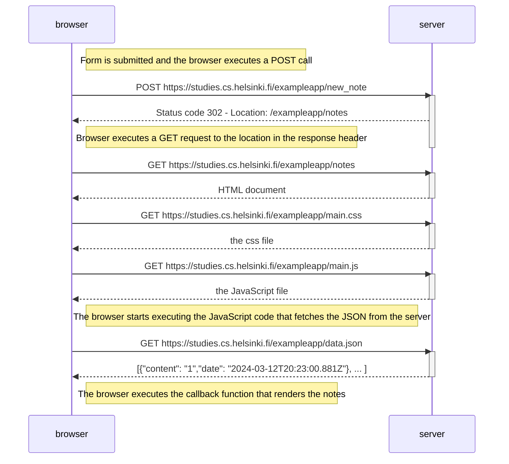

```mermaid
  sequenceDiagram
      participant browser
      participant server

      Note right of browser: Form is submitted and the browser executes  a POST call
      browser->>server: POST https://studies.cs.helsinki.fi/exampleapp/new_note
      activate server

      server-->>browser: Status code 302 - Location: /exampleapp/notes
      Note right of browser: Browser executes a GET request to the location in the response header
      deactivate server

      browser->>server: GET https://studies.cs.helsinki.fi/exampleapp/notes
      activate server
      server-->>browser: HTML document
      deactivate server

      browser->>server: GET https://studies.cs.helsinki.fi/exampleapp/main.css
      activate server
      server-->>browser: the css file
      deactivate server

      browser->>server: GET https://studies.cs.helsinki.fi/exampleapp/main.js
      activate server
      server-->>browser: the JavaScript file
      deactivate server

      Note right of browser: The browser starts executing the JavaScript code that fetches the JSON from the server

      browser->>server: GET https://studies.cs.helsinki.fi/exampleapp/data.json
      activate server
      server-->>browser: [{"content": "1","date": "2024-03-12T20:23:00.881Z"}, ... ]
      deactivate server

      Note right of browser: The browser executes the callback function that renders the notes
```